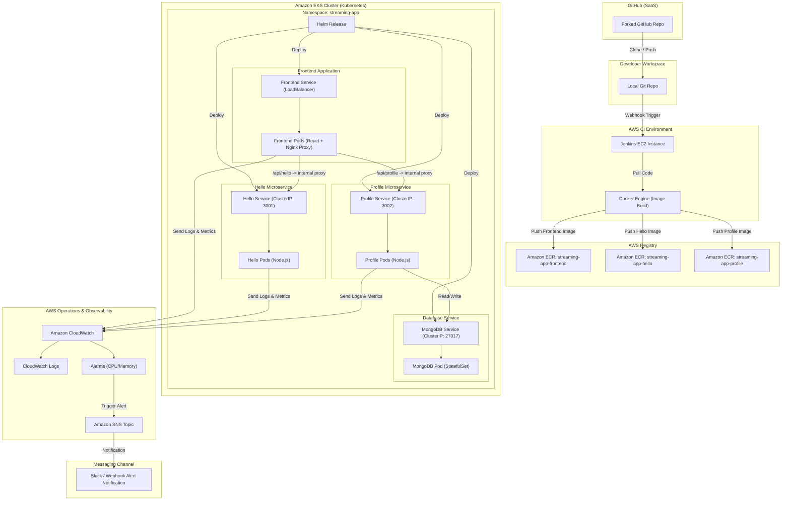

# MERN Stack StreamingApp Deployment: Orchestration and Scaling

This repository contains the deployment, orchestration, and CI/CD configurations for containerizing and deploying the **MERN Microservices StreamingApp** to Amazon Elastic Kubernetes Service (EKS) using Jenkins, Helm, AWS ECR, and CloudWatch.

---

## 🏗️ System Architecture

The updated architecture separates the application into a microservices pattern, using **Nginx** inside the Frontend container to reverse-proxy client requests to internal private APIs:



---

## 🚀 Prerequisites
Ensure you have the following tools installed and configured locally:
- **Git** configured locally.
- **Docker Desktop** installed and running.
- **AWS CLI v2** installed and configured (`aws configure`).
- **kubectl** and **eksctl** installed.
- **Helm v3** installed.

---

## 🛠️ Step-by-Step Execution Guide

---

### Step 1: Version Control Setup & Repository Sync
1. Fork the main repository `https://github.com/UnpredictablePrashant/StreamingApp.git` into your GitHub account.
2. Clone your forked repository locally:
   ```bash
   git clone https://github.com/<YOUR_GITHUB_USERNAME>/StreamingApp.git
   cd StreamingApp
   ```
3. Set the upstream remote to stay synced with the original repository:
   ```bash
   git remote add upstream https://github.com/UnpredictablePrashant/StreamingApp.git
   git remote -v
   ```
4. To sync updates from upstream:
   ```bash
   git fetch upstream
   git checkout main
   git merge upstream/main
   git push origin main
   ```

---

### Step 2: Codebase Configuration & Containerization

#### 1. Configure Frontend API URLs Dynamically
In a local environment, the React app calls APIs on `http://localhost:3001` and `http://localhost:3002`. In production, these services run inside the cluster and shouldn't be exposed publicly. 

To solve this, modify `MERN-microservices/frontend/src/components/Home.js` to fetch from environment-controlled URLs. If not defined, it defaults to the local ports.

Open [Home.js](file:///d:/HeroVired/Assignments/Orchestration_Scaling_Demomstration/MERN-microservices/frontend/src/components/Home.js) and modify the API fetches:

```javascript
// Add these lines at the beginning of your Home component:
const HELLO_SERVICE_URL = process.env.REACT_APP_HELLO_SERVICE_URL || "http://localhost:3001";
const PROFILE_SERVICE_URL = process.env.REACT_APP_PROFILE_SERVICE_URL || "http://localhost:3002";

// Update the helloService fetch:
useEffect(() => {
  axios
    .get(`${HELLO_SERVICE_URL}/`)
    .then((response) => {
      setMessage(response.data.msg);
    })
    .catch((error) => console.error("Error fetching data:", error));
}, [HELLO_SERVICE_URL]);

// Update the profileService fetch:
useEffect(() => {
  axios
    .get(`${PROFILE_SERVICE_URL}/fetchUser`)
    .then((response) => {
      setProfile(response.data);
    })
    .catch((error) => console.error("Error fetching data:", error));
}, [PROFILE_SERVICE_URL]);
```

#### 2. Create the Nginx Reverse Proxy Configuration
Create `docker/nginx.conf` to serve static assets and proxy backend api requests internally:

```nginx
server {
    listen 80;
    server_name localhost;

    location / {
        root /usr/share/nginx/html;
        index index.html index.htm;
        try_files $uri $uri/ /index.html;
    }

    # Proxy /api/hello requests to internal hello-service
    location /api/hello/ {
        proxy_pass http://hello-service:3001/;
        proxy_http_version 1.1;
        proxy_set_header Upgrade $http_upgrade;
        proxy_set_header Connection 'upgrade';
        proxy_set_header Host $host;
        proxy_cache_bypass $http_upgrade;
    }

    # Proxy /api/profile requests to internal profile-service
    location /api/profile/ {
        proxy_pass http://profile-service:3002/;
        proxy_http_version 1.1;
        proxy_set_header Upgrade $http_upgrade;
        proxy_set_header Connection 'upgrade';
        proxy_set_header Host $host;
        proxy_cache_bypass $http_upgrade;
    }
}
```

#### 3. Create the Dockerfiles
Create the following Dockerfiles in your `docker/` folder. Build contexts should be set to the repository root directory when running the docker build commands.

##### **Frontend Dockerfile** (`docker/frontend.Dockerfile`):
```dockerfile
# Stage 1: Build the React Application
FROM node:18-alpine AS build
WORKDIR /app
COPY MERN-microservices/frontend/package*.json ./
RUN npm install
COPY MERN-microservices/frontend/ ./

# Pass backend proxy URLs as build-time args so they are compiled into the React build
ARG REACT_APP_HELLO_SERVICE_URL=/api/hello
ARG REACT_APP_PROFILE_SERVICE_URL=/api/profile
ENV REACT_APP_HELLO_SERVICE_URL=$REACT_APP_HELLO_SERVICE_URL
ENV REACT_APP_PROFILE_SERVICE_URL=$REACT_APP_PROFILE_SERVICE_URL

RUN npm run build

# Stage 2: Serve the application with Nginx
FROM nginx:alpine
COPY --from=build /app/build /usr/share/nginx/html
COPY docker/nginx.conf /etc/nginx/conf.d/default.conf
EXPOSE 80
CMD ["nginx", "-g", "daemon off;"]
```

##### **Hello Service Dockerfile** (`docker/hello-service.Dockerfile`):
```dockerfile
FROM node:18-slim
WORKDIR /app
COPY MERN-microservices/backend/helloService/package*.json ./
RUN npm install --only=production
COPY MERN-microservices/backend/helloService/ ./
EXPOSE 3001
ENV NODE_ENV=production
ENV PORT=3001
CMD ["node", "index.js"]
```

##### **Profile Service Dockerfile** (`docker/profile-service.Dockerfile`):
```dockerfile
FROM node:18-slim
WORKDIR /app
COPY MERN-microservices/backend/profileService/package*.json ./
RUN npm install --only=production
COPY MERN-microservices/backend/profileService/ ./
EXPOSE 3002
ENV NODE_ENV=production
ENV PORT=3002
CMD ["node", "index.js"]
```

#### 4. Run & Test Locally
To test the entire containerized architecture locally:
1. Create a local docker network:
   ```bash
   docker network create streaming-net
   ```
2. Start MongoDB:
   ```bash
   docker run -d --name mongodb --network streaming-net -p 27017:27017 mongo:5.0
   ```
3. Start the Hello Service:
   ```bash
   docker build -t streaming-app-hello -f docker/hello-service.Dockerfile .
   
   docker run -d --name hello-service --network streaming-net -p 3001:3001 -e PORT=3001 streaming-app-hello
   ```
4. Start the Profile Service (connects to the MongoDB container):
   ```bash
   docker build -t streaming-app-profile -f docker/profile-service.Dockerfile .
   
   docker run -d --name profile-service --network streaming-net -p 3002:3002 -e PORT=3002 -e MONGO_URL="mongodb://mongodb:27017/streaming" streaming-app-profile
   ```
5. Start the Frontend (acts as client router and web server):
   ```bash
   docker build -t streaming-app-frontend -f docker/frontend.Dockerfile .
   
   docker run -d --name frontend --network streaming-net -p 80:80 streaming-app-frontend
   ```
6. Access `http://localhost/` in your browser. Verify that you see "Hello World" and user profile lists. Clean up containers once verified:
   ```bash
   docker rm -f frontend profile-service hello-service mongodb
   docker network rm streaming-net
   ```

---

### Step 3: AWS Setup & Amazon ECR Upload

1. Configure AWS CLI with your learner lab credentials:
   ```bash
   aws configure
   ```
2. Create Amazon ECR repositories for all 3 microservices:
   ```bash
   aws ecr create-repository --repository-name streaming-app-frontend --region us-east-1
   aws ecr create-repository --repository-name streaming-app-hello --region us-east-1
   aws ecr create-repository --repository-name streaming-app-profile --region us-east-1
   ```
3. Log in to ECR, tag your local images, and push them to ECR:
   ```bash
   # Log in to ECR
   aws ecr get-login-password --region us-east-1 | docker login --username AWS --password-stdin <YOUR_AWS_ACCOUNT_ID>.dkr.ecr.us-east-1.amazonaws.com

   # Tag and Push Frontend
   docker tag streaming-app-frontend:latest <YOUR_AWS_ACCOUNT_ID>.dkr.ecr.us-east-1.amazonaws.com/streaming-app-frontend:latest
   docker push <YOUR_AWS_ACCOUNT_ID>.dkr.ecr.us-east-1.amazonaws.com/streaming-app-frontend:latest

   # Tag and Push Hello Service
   docker tag streaming-app-hello:latest <YOUR_AWS_ACCOUNT_ID>.dkr.ecr.us-east-1.amazonaws.com/streaming-app-hello:latest
   docker push <YOUR_AWS_ACCOUNT_ID>.dkr.ecr.us-east-1.amazonaws.com/streaming-app-hello:latest

   # Tag and Push Profile Service
   docker tag streaming-app-profile:latest <YOUR_AWS_ACCOUNT_ID>.dkr.ecr.us-east-1.amazonaws.com/streaming-app-profile:latest
   docker push <YOUR_AWS_ACCOUNT_ID>.dkr.ecr.us-east-1.amazonaws.com/streaming-app-profile:latest
   ```

---

### Step 4: Continuous Integration (CI) with Jenkins

1. Access your centralized Jenkins server at **`https://jenkinsacademics.herovired.com/`** and log in with your provided credentials.
2. Ensure the following Jenkins plugins are pre-installed on the server (typically already available on centralized instances):
   - **Pipeline**
   - **Git**
   - **Credentials Binding**
   - **Amazon Web Services SDK / Pipeline Steps**
3. Create your secure credentials inside the Jenkins vault:
   - Navigate to **Manage Jenkins** -> **Credentials** -> **System** -> **Global credentials (unrestricted)** -> **Add Credentials**.
   - **AWS Credentials:**
     - Kind: **AWS Credentials** (if plugin is installed) or configure access keys as environment bindings.
     - ID: `aws-credentials-id`
     - Access Key ID: *Your AWS Access Key*
     - Secret Access Key: *Your AWS Secret Key*
   - **AWS Account ID Secret:**
     - Kind: **Secret text**
     - ID: `aws-account-id`
     - Secret: *Your AWS Account ID* (e.g., `123456789012`)
   - **AWS Default Region Secret:**
     - Kind: **Secret text**
     - ID: `aws-default-region`
     - Secret: *Your AWS default region* (e.g., `us-east-1`)
4. Create a new **Pipeline** job in Jenkins:
   - Enter an item name (e.g., `StreamingApp-CI`).
   - Select **Pipeline** and click OK.
   - Set up your GitHub integration webhooks if triggering automatically, or build manually.
   - Under **Pipeline**, set **Definition** to `Pipeline script from SCM`.
   - Set **SCM** to `Git` and input your Repository URL.
5. Create or replace the root-level [Jenkinsfile](Jenkinsfile) with the following secure, multi-service pipeline that retrieves secrets dynamically:

```groovy
pipeline {
    agent any
    environment {
        FRONTEND_IMAGE = "streaming-app-frontend"
        HELLO_IMAGE = "streaming-app-hello"
        PROFILE_IMAGE = "streaming-app-profile"
    }
    stages {
        stage('Checkout Code') {
            steps {
                checkout scm
            }
        }
        
        stage('AWS ECR Login & Push') {
            steps {
                // Bind AWS Credentials, Account ID, and Default Region from Jenkins Credentials vault
                withCredentials([
                    string(credentialsId: 'aws-account-id', variable: 'AWS_ACCOUNT_ID'),
                    string(credentialsId: 'aws-default-region', variable: 'AWS_DEFAULT_REGION'),
                    [$class: 'AmazonWebServicesCredentialsBinding', credentialsId: 'aws-credentials-id']
                ]) {
                    script {
                        def ecrRegistry = "${AWS_ACCOUNT_ID}.dkr.ecr.${AWS_DEFAULT_REGION}.amazonaws.com"
                        
                        // Log in to ECR
                        sh "aws ecr get-login-password --region ${AWS_DEFAULT_REGION} | docker login --username AWS --password-stdin ${ecrRegistry}"
                        
                        // 1. Build and Push Frontend
                        sh "docker build -t ${FRONTEND_IMAGE}:${BUILD_NUMBER} -f docker/frontend.Dockerfile ."
                        sh "docker tag ${FRONTEND_IMAGE}:${BUILD_NUMBER} ${ecrRegistry}/${FRONTEND_IMAGE}:${BUILD_NUMBER}"
                        sh "docker tag ${FRONTEND_IMAGE}:${BUILD_NUMBER} ${ecrRegistry}/${FRONTEND_IMAGE}:latest"
                        sh "docker push ${ecrRegistry}/${FRONTEND_IMAGE}:${BUILD_NUMBER}"
                        sh "docker push ${ecrRegistry}/${FRONTEND_IMAGE}:latest"
                        
                        // 2. Build and Push Hello Service
                        sh "docker build -t ${HELLO_IMAGE}:${BUILD_NUMBER} -f docker/hello-service.Dockerfile ."
                        sh "docker tag ${HELLO_IMAGE}:${BUILD_NUMBER} ${ecrRegistry}/${HELLO_IMAGE}:${BUILD_NUMBER}"
                        sh "docker tag ${HELLO_IMAGE}:${BUILD_NUMBER} ${ecrRegistry}/${HELLO_IMAGE}:latest"
                        sh "docker push ${ecrRegistry}/${HELLO_IMAGE}:${BUILD_NUMBER}"
                        sh "docker push ${ecrRegistry}/${HELLO_IMAGE}:latest"
                        
                        // 3. Build and Push Profile Service
                        sh "docker build -t ${PROFILE_IMAGE}:${BUILD_NUMBER} -f docker/profile-service.Dockerfile ."
                        sh "docker tag ${PROFILE_IMAGE}:${BUILD_NUMBER} ${ecrRegistry}/${PROFILE_IMAGE}:${BUILD_NUMBER}"
                        sh "docker tag ${PROFILE_IMAGE}:${BUILD_NUMBER} ${ecrRegistry}/${PROFILE_IMAGE}:latest"
                        sh "docker push ${ecrRegistry}/${PROFILE_IMAGE}:${BUILD_NUMBER}"
                        sh "docker push ${ecrRegistry}/${PROFILE_IMAGE}:latest"
                    }
                }
            }
        }
    }
    post {
        always {
            // Clean up unused docker images to save space on Jenkins builder
            sh "docker image prune -f"
        }
    }
}
```

---

### Step 5: Kubernetes Deployment (EKS) via Helm

#### 1. Set Up your Amazon EKS Cluster
Deploy the cluster using `eksctl`:
```bash
eksctl create cluster \
  --name streaming-app-cluster \
  --region us-east-1 \
  --nodegroup-name standard-workers \
  --node-type t3.medium \
  --nodes 2 \
  --managed
```

#### 2. Create the Helm Chart Structure
Run the helm create command inside the repository, or set up the structure manually inside the `helm/` directory.

Create `helm/Chart.yaml`:
```yaml
apiVersion: v2
name: streaming-app
description: A Helm chart to deploy MERN Microservices on EKS
type: application
version: 1.0.0
appVersion: "1.0.0"
```

Update `helm/values.yaml`:
```yaml
replicaCount: 2

awsAccountId: "<YOUR_AWS_ACCOUNT_ID>"
awsRegion: "us-east-1"

frontend:
  image: streaming-app-frontend
  tag: latest
  port: 80
  replicaCount: 2

helloService:
  image: streaming-app-hello
  tag: latest
  port: 3001
  replicaCount: 2

profileService:
  image: streaming-app-profile
  tag: latest
  port: 3002
  replicaCount: 2

mongodb:
  image: mongo
  tag: 5.0
  port: 27017
  replicaCount: 1
  uri: "mongodb://mongodb-service:27017/streaming"
```

Create Kubernetes templates in `helm/templates/`:

##### **MongoDB Resources** (`helm/templates/mongodb-deployment.yaml`):
```yaml
apiVersion: apps/v1
kind: Deployment
metadata:
  name: mongodb-deployment
  namespace: streaming-app
spec:
  replicas: {{ .Values.mongodb.replicaCount }}
  selector:
    matchLabels:
      app: mongodb
  template:
    metadata:
      labels:
        app: mongodb
    spec:
      containers:
        - name: mongodb
          image: "{{ .Values.mongodb.image }}:{{ .Values.mongodb.tag }}"
          ports:
            - containerPort: {{ .Values.mongodb.port }}
---
apiVersion: v1
kind: Service
metadata:
  name: mongodb-service
  namespace: streaming-app
spec:
  ports:
    - port: {{ .Values.mongodb.port }}
      targetPort: {{ .Values.mongodb.port }}
  selector:
    app: mongodb
```

##### **Hello Service Resources** (`helm/templates/hello-deployment.yaml`):
```yaml
apiVersion: apps/v1
kind: Deployment
metadata:
  name: hello-deployment
  namespace: streaming-app
spec:
  replicas: {{ .Values.helloService.replicaCount }}
  selector:
    matchLabels:
      app: hello-service
  template:
    metadata:
      labels:
        app: hello-service
    spec:
      containers:
        - name: hello-service
          image: "{{ .Values.awsAccountId }}.dkr.ecr.{{ .Values.awsRegion }}.amazonaws.com/{{ .Values.helloService.image }}:{{ .Values.helloService.tag }}"
          ports:
            - containerPort: {{ .Values.helloService.port }}
          env:
            - name: PORT
              value: "{{ .Values.helloService.port }}"
---
apiVersion: v1
kind: Service
metadata:
  name: hello-service
  namespace: streaming-app
spec:
  ports:
    - port: {{ .Values.helloService.port }}
      targetPort: {{ .Values.helloService.port }}
  selector:
    app: hello-service
```

##### **Profile Service Resources** (`helm/templates/profile-deployment.yaml`):
```yaml
apiVersion: apps/v1
kind: Deployment
metadata:
  name: profile-deployment
  namespace: streaming-app
spec:
  replicas: {{ .Values.profileService.replicaCount }}
  selector:
    matchLabels:
      app: profile-service
  template:
    metadata:
      labels:
        app: profile-service
    spec:
      containers:
        - name: profile-service
          image: "{{ .Values.awsAccountId }}.dkr.ecr.{{ .Values.awsRegion }}.amazonaws.com/{{ .Values.profileService.image }}:{{ .Values.profileService.tag }}"
          ports:
            - containerPort: {{ .Values.profileService.port }}
          env:
            - name: PORT
              value: "{{ .Values.profileService.port }}"
            - name: MONGO_URL
              value: "{{ .Values.mongodb.uri }}"
---
apiVersion: v1
kind: Service
metadata:
  name: profile-service
  namespace: streaming-app
spec:
  ports:
    - port: {{ .Values.profileService.port }}
      targetPort: {{ .Values.profileService.port }}
  selector:
    app: profile-service
```

##### **Frontend Resources** (`helm/templates/frontend-deployment.yaml`):
```yaml
apiVersion: apps/v1
kind: Deployment
metadata:
  name: frontend-deployment
  namespace: streaming-app
spec:
  replicas: {{ .Values.frontend.replicaCount }}
  selector:
    matchLabels:
      app: frontend
  template:
    metadata:
      labels:
        app: frontend
    spec:
      containers:
        - name: frontend
          image: "{{ .Values.awsAccountId }}.dkr.ecr.{{ .Values.awsRegion }}.amazonaws.com/{{ .Values.frontend.image }}:{{ .Values.frontend.tag }}"
          ports:
            - containerPort: {{ .Values.frontend.port }}
---
apiVersion: v1
kind: Service
metadata:
  name: frontend-service
  namespace: streaming-app
spec:
  type: LoadBalancer
  ports:
    - port: {{ .Values.frontend.port }}
      targetPort: {{ .Values.frontend.port }}
  selector:
    app: frontend
```

#### 3. Deploy using Helm
Run the following commands to validate and deploy the stack:
```bash
# Validate chart
helm lint ./helm

# Dry-run execution
helm install streaming-app ./helm --namespace streaming-app --create-namespace --dry-run

# Run full deployment
helm upgrade --install streaming-app ./helm --namespace streaming-app --create-namespace
```

Once deployed, fetch the details of running components:
```bash
kubectl get all -n streaming-app
```

---

### Step 6: Monitoring & Logging

#### 1. Monitoring setup (CloudWatch Container Insights)
Enable CloudWatch Container Insights on EKS:
```bash
# Associate IAM OIDC provider for your EKS Cluster
eksctl utils associate-iam-oidc-provider --cluster streaming-app-cluster --approve

# Install CloudWatch agent and Fluent-bit DaemonSet using AWS Quick Start
kubectl apply -f https://raw.githubusercontent.com/aws-samples/amazon-cloudwatch-container-insights/latest/k8s-deployment-manifest-templates/deployment-mode/daemonset/container-insights-monitoring/quickstart/cwagent-fluent-bit-quickstart.yaml
```

#### 2. Logging setup
CloudWatch Logs will automatically stream log lines from containers located under `/var/log/containers` on EKS nodes directly into **CloudWatch Log Groups** (e.g., `/aws/containerinsights/streaming-app-cluster/application`).

#### 3. CPU/Memory Alarm configuration
Create alarms on the Amazon CloudWatch console matching EKS Node metrics (e.g. CPUUtilization > 80% for 5 minutes).

---

### Step 7: ChatOps Integration (Bonus)

1. Create a Standard **Amazon SNS Topic** (e.g. `streaming-app-alerts`).
2. Set up **AWS Chatbot** or configure an **AWS Lambda** subscriber inside SNS.
3. Configure the lambda function or AWS Chatbot to forward incoming alerts to your Messaging Workspace Webhook (Slack, MS Teams, or Telegram API).
4. Link your CloudWatch Alarms to trigger SNS publish actions whenever states flip to `ALARM`.

---

## 📸 Project Validation Deliverables
Ensure you take the following screenshots for your final project report:
1. **Upstream Status:** Terminal output of `git remote -v`.
2. **ECR Repositories:** AWS Console ECR view showing `streaming-app-frontend`, `streaming-app-hello`, and `streaming-app-profile` containing built tags.
3. **Jenkins Run:** Jenkins dashboard depicting successful execution steps for checkout, login, and three sequential Docker pushes.
4. **Kubernetes Resources:** Output of `kubectl get all -n streaming-app` showing frontend, hello, profile, and mongodb running successfully.
5. **App Browser Test:** Screenshot of the React homepage resolving on the AWS Classic LoadBalancer public DNS address showing backend service values.
6. **CloudWatch logs:** Screenshot of AWS CloudWatch Log streams depicting node output logs.
7. **ChatOps Alert:** Screenshot of Telegram/Slack message confirming triggered notifications.
